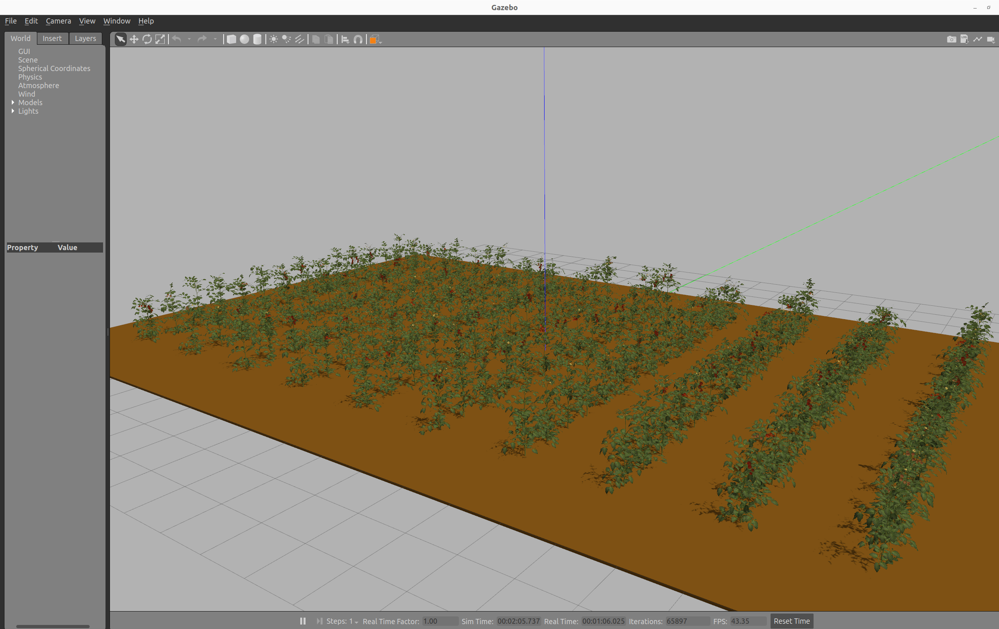
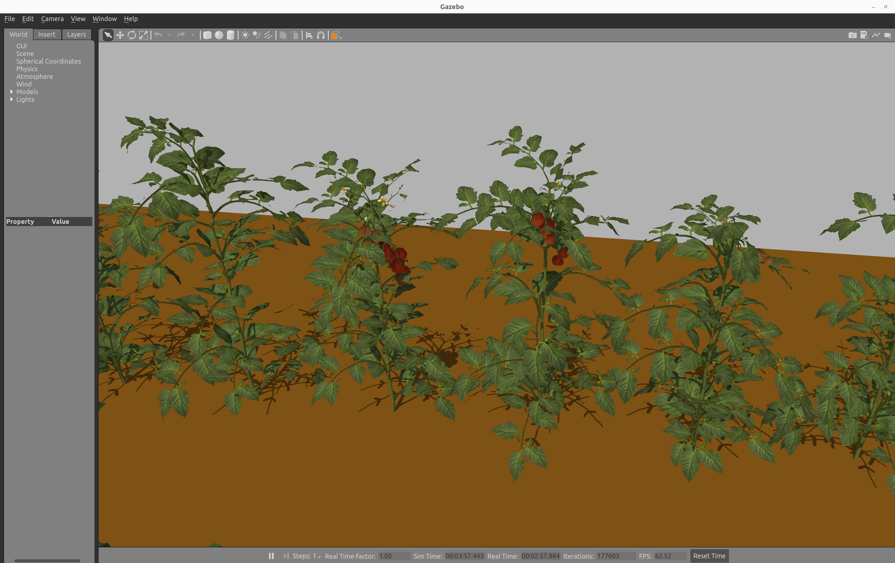
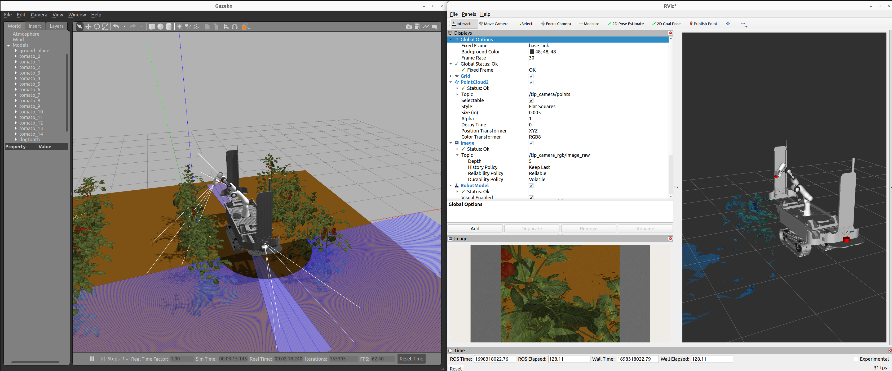

# 温室串收番茄农场仿真（aoc_tomato_farm）

基于 **ROS 2 Humble + Gazebo Classic 11** 的温室番茄农场仿真环境，面向农业机器人感知与采摘算法研究。

本项目包含四部分核心内容：

1. **温室农场场景**：22m×14m 温室，75 株果串番茄（每株 4 条果串 × 12 颗果实）+ 栽培床 + 补光灯 + 大棚结构，并提供多个不同尺寸的露天农场世界
2. **植株随机化体系**：12 个 Blender 随机化植株变体（果串方位角/主茎倾角/成熟度/缩放等）+ 世界布局随机生成器（固定种子、可复现）
3. **果实真值体系**：三层 markers（模型级 → 变体级 → 世界级），像素级对齐画面，供感知/采摘算法评测
4. **工具链**：Blender 资产管线、程序化果串生成器、世界重排脚本、经典视觉感知节点、仿真采摘 demo

Gazebo Classic 温室农场：

 

移动操作臂（Dogtooth 移动底盘 + Franka 机械臂）在番茄农场中：



---

## 1. 环境要求

| 组件 | 版本 | 说明 |
|---|---|---|
| Ubuntu | **22.04 LTS** | Humble 仅支持 22.04，24.04 装不了 Gazebo Classic |
| ROS 2 | Humble | `ros-humble-desktop` |
| Gazebo | Classic **11** | `gazebo11 libgazebo11-dev` |
| ROS-Gazebo 桥接 | — | `ros-humble-gazebo-ros-pkgs` |
| 编译工具 | — | `python3-colcon-common-extensions` |

完整安装与首次运行步骤见 **[RUNNING.md](RUNNING.md)**。

## 2. 快速开始

```bash
# 完整温室农场（75 株随机化果串番茄，一键启动）
bash ~/aoc_tomato_farm/view_farm.sh

# 标准 ROS 2 方式启动温室（默认 22mx14m 农场）
ros2 launch aoc_tomato_farm_gazebo tomato_farm_world.launch.py

# 单株番茄查看（免编译）
bash ~/aoc_tomato_farm/view_vine.sh
```

键盘遥控移动底盘：

```bash
ros2 run teleop_twist_keyboard teleop_twist_keyboard
```

控制 Franka 机械臂到指定位姿：

```bash
ros2 run franka controller -1.57 +0.67 0 0 0 1.3 -2.3 0
```

## 3. 目录结构详解

```
aoc_tomato_farm/                      # 本目录即 colcon 工作区根（colcon build 在此执行）
│
├── aoc_tomato_farm_gazebo/           # ★ 核心 Gazebo 环境包（CMake）
│   ├── models/22mx14m/               #   温室全部模型（详见下表）
│   ├── worlds/                       #   各尺寸农场世界文件
│   │   ├── 22mx14m/                  #     温室世界（ros2 launch 使用，v0~v11 变体混排）
│   │   ├── 12mx9m/ 8mx7m/ 4mx6m/     #     旧露天农场（使用旧散果植株 tomato_N）
│   │   ├── real_plants/              #     真实扫描植株世界（2024 实物采集资产）
│   │   └── preview/                  #     单株/果串预览世界（view_vine/view_truss 使用）
│   ├── launch/                       #   tomato_farm_world.launch.py（纯环境）等 9 个启动文件
│   └── config/                       #   Gazebo/ROS 配置
│
├── franka/                           # ★ Franka 机械臂包（Python）
│   ├── worlds/                       #   温室世界（view_farm.sh 与 simulation_farm.launch.py 使用）
│   ├── models/                       #   panda 机械臂、chessboard 模型
│   ├── description/ srdf/            #   URDF/xacro 与 SRDF
│   ├── franka/                       #   controller 等控制节点源码
│   └── launch/                       #   simulation_farm.launch.py 等 4 个启动文件
│
├── dogtooth/                         # Dogtooth 移动底盘（5 个子包：node/description/control/msgs/gazebo）
│
├── asset_extract/                    # ★ Blender 资产管线（生成植株变体的源头）
│   ├── build_plant.py                #   组装完整植株（枝叶花 + 3 果串）→ tomato_plant_repo
│   ├── build_vine.py                 #   组装倾斜藤株（基础款）→ tomato_vine_repo
│   ├── build_variants.py             #   生成 12 个随机化变体 → out/variants/v0~v11
│   ├── export_truss*.py              #   从作者 blend 导出果串网格（带 UV/法线）
│   ├── preview_*.py render_truss.py  #   Blender 内渲染目检
│   ├── gz_textures/                  #   AG15 实物扫描贴图（果实/叶/花/茎）
│   ├── unity_tomato_farm_generator/  #   上游 Unity 资产（tomato1.blend 果串源文件等）
│   └── out/variants/                 #   12 变体最终成果（dae + markers + params，已入库）
│
├── tools/                            # ★ 独立工具脚本（不参与 colcon 编译）
│   ├── assets/                       #   资产工具
│   │   ├── truss_generator.py        #     程序化果串植株生成器（纯 Python，果数/串数/种子可调）
│   │   ├── compose_plant*.py         #     DAE 几何组合工具（果串挂接到散果挂点）
│   │   ├── fix_truss_shape.py        #     果串外形修正（Blender）
│   │   └── truss_preview.py          #     果串预览
│   ├── perception/                   #   感知与采摘
│   │   ├── fruit_detector.py         #     果实感知节点（经典视觉路线）
│   │   ├── harvest_demo.py           #     仿真采摘 demo（感知闭环 / markers 真值两种模式）
│   │   ├── grab_image.py             #     抓取仿真相机图像
│   │   ├── calibrate_extrinsics.py   #     相机外参标定
│   │   └── camera_extrinsic_calibration.npy  #  标定结果
│   └── worlds/
│       └── gen_farm_world.py         #   温室世界随机化重排（变体指派 + yaw 抖动 + markers 重生成）
│
├── gazebo_tomato_farm_generator/     # 上游农场生成器（LCAS，notebook 参数化生成露天农场）
├── docs/                             # 截图文档 + debug_worlds/（8 个历史调试世界存档）
├── view_farm.sh                      # 一键启动温室（gzserver+gzclient，端口 11390）
├── view_vine.sh / view_truss.sh / view_truss_scene.sh   # 单株 / 果串查看
├── gazebo_port.env                   # Gazebo 端口隔离环境变量（11390，避开其他项目默认 11345）
├── README.md / RUNNING.md            # 本文档 / 首次运行指南
└── .gitignore                        # 已排除 build/install/log、asset_extract/out 中间产物等
```

### 温室模型清单（`aoc_tomato_farm_gazebo/models/22mx14m/`）

| 模型 | 数量 | 说明 |
|---|---|---|
| `greenhouse_structure` | 1 | 温室大棚主体结构 |
| `soilbed_model` | 75 | 栽培床（每株一床） |
| `flowerpot_model` | 75 | 花盆 |
| `lamp_model` | — | 补光灯（温室内 15 盏） |
| `metal_model` | — | 金属构件 |
| `tomato_vine_repo` | 1 | **基础款果串藤株**：倾斜细藤 + 作者结果枝 + 4 条果串（红/红/半/青） |
| `tomato_vine_repo_v0`~`v11` | 12 | **随机化变体**：主茎倾角 22~38°、果串方位角 0~360°（间隔≥60°）、挂点高度 ±0.08m、整株缩放 0.90~1.12、成熟度模板、叶幕滚转全部随机（种子 42+k） |
| `tomato1_truss` | 1 | 独立果串模型（12 果 + 果梗轴，来自作者 tomato1.blend） |
| `tomato_truss_7 / 21 / 42` | 3 | `truss_generator.py` 程序化生成的果串植株（果实数可调） |
| `tomato_plant_repo` / `tomato_plant_truss` | 2 | 组合植株（枝叶花 + 3 果串，早期方案） |
| `tomato_0`~`tomato_152` | 150 | 旧散果植株（上游生成器产物，仅旧露天世界使用） |

## 4. 随机化体系

温室场景的随机化分**两层**，全部使用固定种子、完全可复现：

### 4.1 植株变体层（`asset_extract/build_variants.py`，Blender 管线）

12 个变体 v0~v11，随机维度：

1. 主茎倾角 22~38°
2. **果串连接方位角 0~360°**（相邻间隔强制 ≥60°，防止重叠）
3. 果串挂点高度 ±0.08m
4. 整株缩放 0.90~1.12
5. 成熟度模板（红/橙/青 混合方案 ×4）
6. 顶部叶幕绕茎滚转角

每个变体的实际参数记录在 `asset_extract/out/variants/vK/params.json`，本地坐标果实真值在同目录 `markers.json`（每株 48 颗）。

### 4.2 世界布局层（`tools/worlds/gen_farm_world.py`，纯 Python）

```bash
python3 tools/worlds/gen_farm_world.py            # 默认种子 42
python3 tools/worlds/gen_farm_world.py --seed 7   # 换一种布局
```

- 把 75 个槽位（0.7m 网格）伪随机均衡指派 12 个变体（每个 6~7 棵）+ 每棵 ±45° 朝向抖动
- 同步重生成世界坐标 markers：`世界坐标 = R(yaw) · 变体本地坐标 + (px, py, pz)`（已与画面像素级对齐）
- 输出三件套：
  - `franka/worlds/tomato_farm_22mx14m_gazebo_classic.world`（温室世界）
  - `franka/worlds/tomato_farm_markers.json`（3600 条果实真值）
  - `franka/worlds/tomato_farm_manifest.json`（槽位→变体+位姿清单，复现评测用）

> 注意：改布局后需 `colcon build --packages-select franka --symlink-install` 同步到 install（symlink 模式自动生效）。

## 5. 果实真值（markers）体系

| 层级 | 文件 | 内容 |
|---|---|---|
| 模型级 | `models/22mx14m/markers.json` | 株级标记（采摘 demo 用于定位可达植株） |
| 变体级 | `asset_extract/out/variants/vK/markers.json` | 每个变体 48 颗果的植株本地坐标（随机化源头） |
| 世界级 | `franka/worlds/tomato_farm_markers.json`（温室）<br>`aoc_tomato_farm_gazebo/worlds/22mx14m/tomato_farm_markers.json`（ros2 launch 版） | 世界坐标真值，3600 条 |

世界级 schema（每颗果实一条）：

```json
{"marker_type": "FRUIT", "plant_id": "vine_plant_37", "variant": 10,
 "truss_id": 2, "ripeness": "red", "translation": [1.234, -0.567, 0.890]}
```

**铁律**：世界级 markers 必须与 world 文件**同种子、同批生成**（用 `gen_farm_world.py` 即可保证），手工改 world 不改 markers 会导致真值错位。

## 6. 启动文件一览

| 启动文件 | 用途 |
|---|---|
| `aoc_tomato_farm_gazebo` `tomato_farm_world.launch.py` | 纯温室环境（Gazebo Classic） |
| `aoc_tomato_farm_gazebo` `tomato_farm_world_mobile_manipulator_001.launch.py` | 移动操作臂（Dogtooth + Franka）进温室 |
| `aoc_tomato_farm_gazebo` `tomato_real_plant_farm_world.launch.py` | 真实扫描植株世界 |
| `franka` `simulation_farm.launch.py` | Franka 视角的温室仿真 |
| 机械臂参数 | `dogtooth/dogtooth_description/urdf/mobile_manipulator_001.urdf.xacro` 中 `spawn_manipulator` / `spawn_mobile_robot` 开关控制是否生成机械臂/底盘 |

## 7. 感知与采摘工具

```bash
# 果实感知节点（经典视觉：颜色/形状分割）
python3 tools/perception/fruit_detector.py

# 仿真采摘 demo（感知闭环版；--source markers 可切真值对照模式）
python3 tools/perception/harvest_demo.py --farm 22mx14m \
    --robot_x 0 --robot_y 0 --robot_yaw 0 --reach 1.2

# 相机图像抓取 / 外参标定
python3 tools/perception/grab_image.py
python3 tools/perception/calibrate_extrinsics.py
```

## 8. 资产再生成流程（需要 Blender）

植株资产的依赖链：**作者资产**（`tomato.dae` 枝叶花 + `tomato1.blend` 果串，均带实物扫描贴图 AG15）→ `build_plant.py` / `build_vine.py` 组装 → `build_variants.py` 随机化 ×12 → 手动复制到 `aoc_tomato_farm_gazebo/models/22mx14m/`。

程序化补充路线：`tools/assets/truss_generator.py` 不依赖 Blender，可直接生成"每串 5~9 颗果"的程序化果串植株（含 FRUIT/PEDICEL 真值），适合扩充果实数量多样性。

```bash
python3 tools/assets/truss_generator.py --out <模型输出目录> --seed 42 \
    --fruits-per-truss 6 --trusses 6 --model-name tomato_truss_42
```

## 9. 端口隔离约定

本项目的所有 Gazebo 实例统一使用 **端口 11390**（`gazebo_port.env`），与本机其他项目（如使用默认 11345 的项目）完全隔离。view 脚本已内置该设置，并只会清理绑定在 11390 上的旧实例。

## 10. 已知注意事项

- `panda_ign_moveit2/`（MoveIt 2 示例）为第三方仓库，不在本仓库内，需要时单独克隆
- 旧露天农场世界（12mx9m 等）使用旧散果植株 `tomato_N`，与温室的果串植株是两代资产，勿混用
- `docs/debug_worlds/` 为历史调试场景存档，仅作参考
- 温室世界加载约 10~30 秒（75 株 × 12 种模型）
